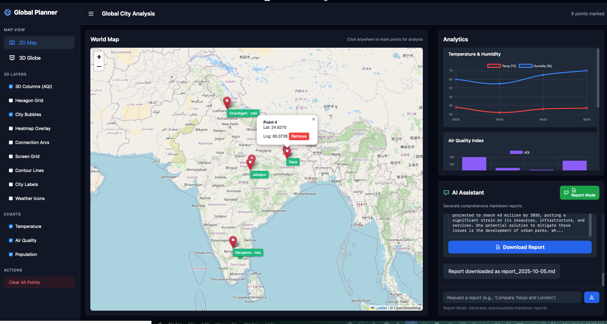
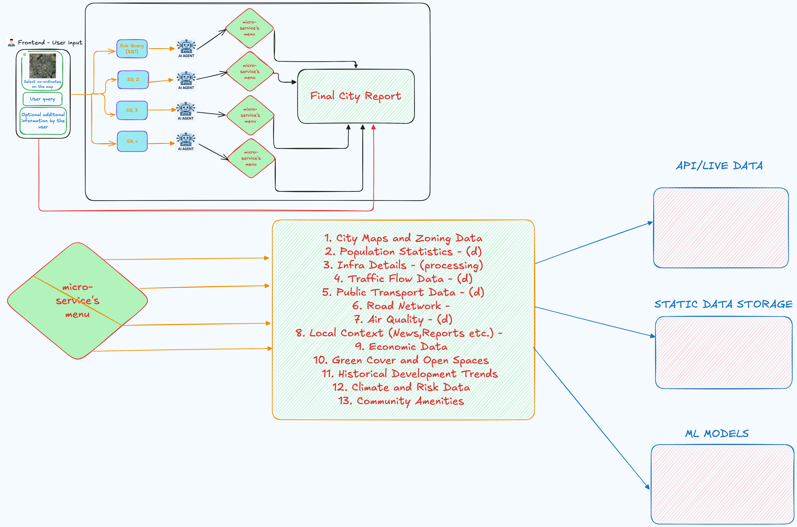

# Geo Spatial City Planning Agent

# Cursor for Urban Planners

**An AI-powered intelligence platform for city planning and urban analysis**



## What is Cursor for Urban Planners?

Cursor for Urban Planners brings the power of AI-assisted development to urban planning and city analysis. Just as Cursor IDE revolutionized software development with AI pair programming, this platform transforms how urban planners, researchers, and city officials analyze and understand cities worldwide.

Think of it as having an expert urban planning team at your fingertips - one that can instantly pull real-time data from multiple sources, visualize complex urban patterns in 2D and 3D, and generate comprehensive reports about any city on Earth.

## Architecture



The platform employs a **multi-agent AI architecture** where specialized MCP (Model Context Protocol) services act as expert consultants in different domains:

[](https://www.youtube.com/watch?v=N2Y-GupjjWE)

### The AI Agent Team

Each agent is a specialist that brings domain-specific intelligence:

- **Air Quality Analyst** (AQICN MCP) - Real-time pollution and air quality monitoring
- **Weather Specialist** (Visual Crossing) - Climate patterns, forecasts, and historical weather data
- **Traffic Engineer** (TomTom) - Real-time traffic flow, congestion analysis, road network data
- **Demographics Expert** (Google Data Commons) - Population statistics, economic indicators, social metrics
- **Research Assistant** (DuckDuckGo) - General information gathering and context research
- **Strategic Thinker** (Sequential Thinking) - Advanced reasoning and multi-step analysis

These agents work in concert, coordinated by GPT-4o and Cerebras AI models, to provide comprehensive urban intelligence through LangChain and LangGraph orchestration.

## Core Capabilities

### Dual-Mode Intelligence

**Chat Mode** - Your Interactive Urban Planning Assistant

- Ask natural language questions about any city
- Click locations on the map for instant analysis
- Get real-time answers with live data visualization
- Interactive query processing with context awareness
- Example: "What's the air quality like in Delhi today?"

**Report Mode** - Comprehensive Urban Analysis

- Generate professional markdown reports on demand
- Compare multiple cities across dozens of metrics
- Export detailed analyses for stakeholders
- AI-powered query decomposition and sub-question generation
- Example: "Generate a sustainability report comparing Copenhagen and Singapore"

### Advanced Visualization Engine

**2D Mapping** (Leaflet)

- Interactive world map with precision point marking
- Custom overlays and data layers
- Real-time city data integration

**3D Visualization** (Deck.gl Globe)

- Nine specialized visualization layers:
  - **3D Columns**: Visualize AQI levels as vertical bars
  - **Hexagon Grid**: Aggregate spatial density patterns
  - **City Bubbles**: Population-scaled point visualization
  - **Heatmap**: Temperature and environmental gradients
  - **Connection Arcs**: City relationships and flows
  - **Screen Grid**: High-density aggregation
  - **Contour Lines**: Topographic environmental data
  - **City Labels**: Geographic annotation
  - **Weather Icons**: Real-time condition indicators

**Analytics Dashboard**

- Temperature and humidity trends
- Air quality indices with health categories
- Population demographics and comparisons
- Chart.js powered data visualizations

## Data Intelligence

The platform integrates **13 critical urban planning data categories**:

1. **City Maps and Zoning Data** - Spatial layouts and land use patterns
2. **Population Statistics** - Demographics, density, growth trends
3. **Infrastructure Details** - Built environment and utilities
4. **Traffic Flow Data** - Congestion patterns and mobility metrics
5. **Public Transport Data** - Transit networks and accessibility
6. **Road Networks** - Street layouts and connectivity analysis
7. **Air Quality Metrics** - Pollution levels and health impacts
8. **Local Context** - News, reports, and current events
9. **Economic Data** - GDP, employment, development indicators
10. **Green Cover and Open Spaces** - Parks, urban forestry, public spaces
11. **Historical Development Trends** - Urban growth patterns over time
12. **Climate and Risk Data** - Vulnerability assessments, disaster preparedness
13. **Community Amenities** - Schools, hospitals, cultural facilities

### Data Sources (via MCP Integration)

All data is pulled in real-time through standardized MCP interfaces:

- **API/Live Data**: Real-time feeds from AQICN, Visual Crossing, TomTom
- **Static Data Storage**: Google Data Commons for demographics and statistics
- **ML Models**: Sequential thinking for advanced analysis and reasoning
- **Web Intelligence**: DuckDuckGo for contextual information gathering

## Sample Queries and Use Cases

### Urban Planning Analysis

```
"Analyze the urban development potential of Mohali, India, including traffic
infrastructure, air quality trends, and population growth projections"
```

### Comparative City Analysis

```
"Compare Delhi and Mumbai in terms of air quality, traffic congestion, and
urban growth patterns for the next 5 years"
```

### Infrastructure Planning

```
"Evaluate the need for new public transit routes in Chandigarh based on
population density and current traffic patterns"
```

### Environmental Impact Assessment

```
"Assess the environmental impact of proposed industrial development in Punjab,
focusing on air quality and weather patterns"
```

### Traffic and Transportation

```
"Analyze current traffic flow patterns in Delhi and recommend optimization
strategies for peak hours"
```

### Regional Development Planning

```
"Create a comprehensive development plan for smart city initiatives in Mohali,
including energy demand forecasting and land use optimization"
```

## Professional Applications

**For Urban Planners**

- Assess potential development sites across multiple criteria
- Compare infrastructure between peer cities
- Generate impact assessments for planning proposals
- Optimize transit routes and transportation networks

**For City Officials**

- Monitor real-time environmental conditions
- Track urban metrics against policy goals
- Create reports for public communication
- Make data-driven policy decisions

**For Researchers**

- Conduct comparative urban studies
- Analyze climate resilience across cities
- Study urbanization patterns globally
- Access multi-source integrated datasets

**For Consultants**

- Rapid city assessments for client proposals
- Multi-city benchmarking studies
- Due diligence for urban development projects
- Professional report generation with executive summaries

**For Educators**

- Interactive urban geography lessons
- Case study generation for coursework
- Real-world data for student projects
- Visual learning with 3D mapping

## Technology Foundation

### Backend

- **FastAPI**: Modern, high-performance web framework
- **Uvicorn**: ASGI server for production deployment
- **Python 3.11+**: Core programming language

### AI & Language Models

- **Llama**: Primary intelligence coordinator
- **Cerebras Cloud SDK**: High-speed AI inference
- **LangChain**: LLM application framework
- **LangGraph**: Agent orchestration and workflow management

### Data Processing

- **Pydantic**: Data validation and serialization
- **TikToken**: Token counting and text processing
- **Loguru**: Advanced logging capabilities

### Frontend Stack

- **Leaflet.js**: 2D interactive mapping
- **Deck.gl**: 3D geospatial visualizations
- **Chart.js**: Data visualization and analytics
- **Tailwind CSS**: Modern UI styling

### Integration Layer

- **Model Context Protocol (MCP)**: Standardized service integration
- **LangChain MCP Adapters**: MCP-to-LangChain bridges
- **Docker**: Containerized service deployment

## The MCP Architecture Advantage

By using the Model Context Protocol, Cursor for Urban Planners achieves:

- **Modularity**: Each data source is an independent, upgradeable service
- **Extensibility**: New data sources can be added without changing core code
- **Reliability**: Service failures are isolated and don't crash the system
- **Scalability**: Agents can be distributed and load-balanced
- **Maintainability**: Each agent has a single, clear responsibility
- **Flexibility**: Mix and match services based on query requirements

## Quick Start

**Prerequisites**: Python 3.11+, Node.js 18+, Docker, API keys (OpenAI, Cerebras, TomTom, Visual Crossing)

```bash
# 1. Set up environment
cp .env.example .env  # Add your API keys

# 2. Install dependencies
uv sync  # or pip install -r requirements.txt

# 3. Start backend
uvicorn backend:app --reload

# 4. Open frontend
open index.html
```

## API Endpoints

**`POST /api/city-data`** - Interactive chat queries with map context

- Real-time city analysis
- Map-based coordinate processing
- JSON response with visualization data

**`POST /plan`** - Comprehensive report generation

- Multi-source data synthesis
- Markdown-formatted reports
- AI-powered query decomposition

**`GET /health`** - System status and configuration check

**`GET /`** - API information and documentation

## Project Structure

```
Cursor-for-Urban-Planners/
├── backend.py                      # FastAPI application
├── index.html                      # Main frontend interface
├── requirements.txt                # Python dependencies
├── .env                           # Environment configuration
├── MCP/                           # Model Context Protocol
│   ├── cerebras_client.py         # Cerebras AI integration
│   ├── overall_main.py            # Query processing pipeline
│   ├── prompts.json               # System prompts
│   ├── mcp_servers.json           # MCP configurations
│   └── MCP_token_summizer.py      # Text summarization
├── services/                      # MCP service implementations
│   ├── AQI/                       # Air quality service
│   ├── weather/                   # Weather data service
│   └── traffic/                   # Traffic data service
└── City Planning ML Models MCP/   # ML model integrations
    └── integrated_client.py       # ML client interface
```

## From Concept to Reality

This isn't just a mapping tool - it's an **AI-powered urban intelligence platform** that brings together:

- Real-time data from 6+ specialized services
- Advanced 3D visualization capabilities
- Natural language interaction with context awareness
- Professional report generation with executive summaries
- Multi-agent AI coordination via LangChain/LangGraph
- Intelligent query decomposition and synthesis

The result? A tool that feels like having an entire urban planning consultancy available 24/7, capable of analyzing any city on Earth within seconds, with the intelligence to understand complex queries and deliver actionable insights.

---

**Built for urban planners, by understanding what planners need**: Fast insights, reliable data, professional outputs, and the ability to see patterns that spreadsheets hide. Powered by cutting-edge AI orchestration and real-time multi-source data integration.
